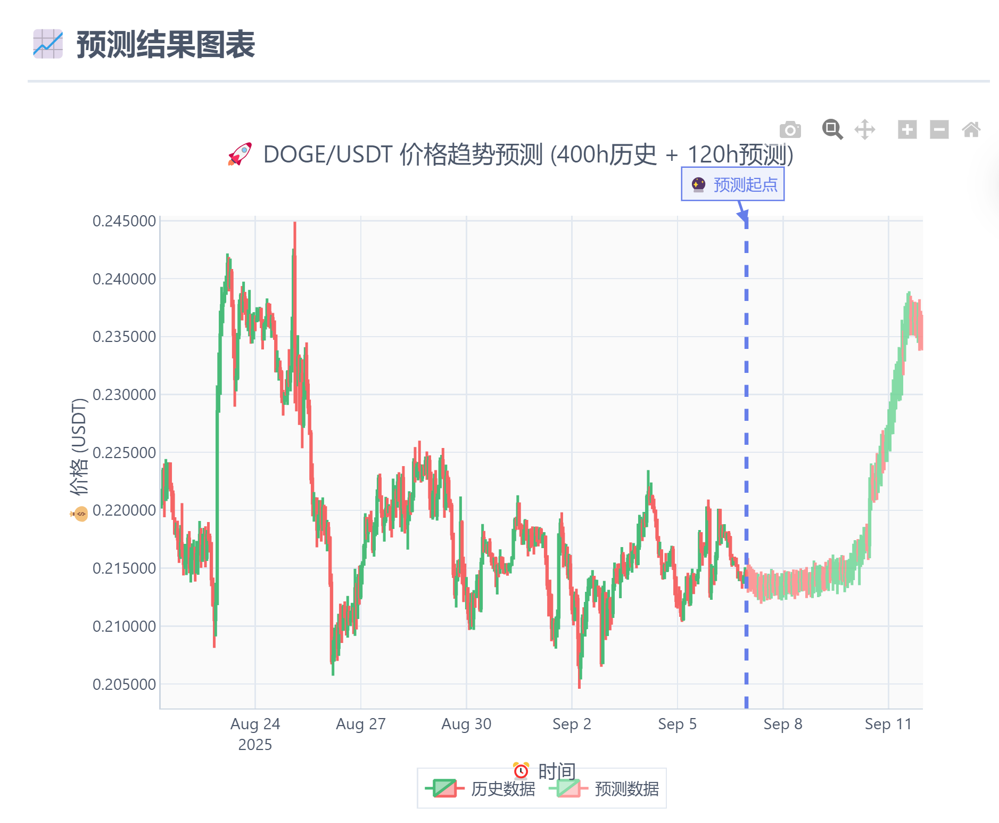
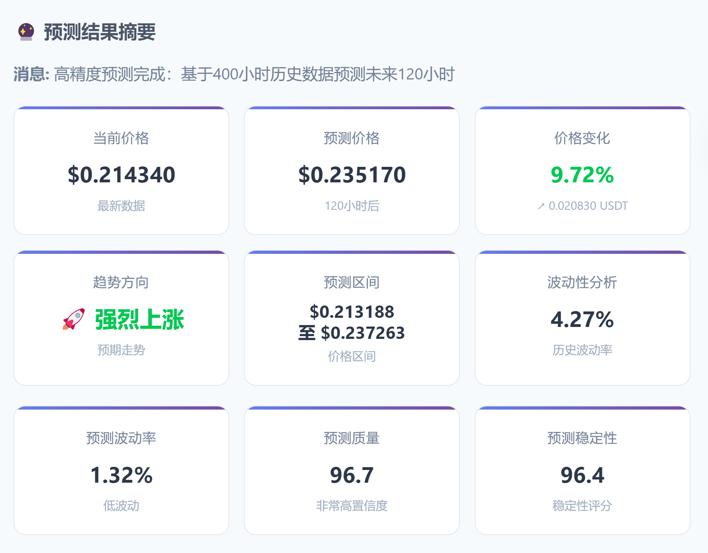

<div align="center">
  <h1><b>🚀 Kronos DOGE/USDT 预测系统</b></h1>
  <p>基于微调Kronos模型的专业级DOGE/USDT价格预测系统</p>
</div>

<div align="center">

<a href="https://huggingface.co/Ramond-e/models"> 
 
</a> 
<a href="https://github.com/shiyu-coder/Kronos"> 
 
</a> 
<a href="https://github.com/Ramond-e/Kronos-DOGEUSDT-finetune?tab=MIT-1-ov-file"> 
 
</a>

</div>

<p align="center">

</p>

> **完整的DOGE/USDT预测解决方案** - 包含Web界面、实时预测、模型微调和数据管理的一体化系统

## ✨ 主要特色

- 🌐 **专业Web界面** - 基于Flask的实时预测系统，支持交互式图表
- 🔮 **高精度预测** - 微调Kronos模型，预测未来120小时价格趋势  
- 📡 **实时数据** - 自动从Binance获取最新400小时K线数据
- 📊 **可视化分析** - Plotly.js专业金融图表，支持K线和趋势分析
- 🛡️ **质量控制** - Temperature、Top-p等参数精确控制预测质量
- 🎯 **智能分析** - 5级趋势分类和波动性分析

## 🚀 快速开始

### 1. 环境准备

```bash
# 克隆项目
git clone https://github.com/Ramond-e/Kronos-DOGEUSDT-finetune.git
cd kronos

# 安装依赖
pip install -r requirements.txt
```

### 2. 启动Web预测系统

**Windows用户（推荐）**:
```bash
cd webui
pip install -r requirements.txt
start.bat
```

**所有平台**:
```bash
cd webui  
pip install -r requirements.txt
python run.py
```

启动后访问：http://127.0.0.1:5000

### 3. 使用Web界面

1. **启动系统** → 自动检查环境和模型状态
2. **开启实时数据** → 勾选"📡 自动获取最新数据"（推荐）
3. **调整参数** → Temperature=1.0, top_p=0.9为推荐设置
4. **开始预测** → 点击"🔮 开始预测"按钮
5. **分析结果** → 查看K线图表、趋势分析和预测结果

<p align="center">

</p>

## 📊 Web界面功能

### 🎯 核心功能
- **实时数据获取**: 每次预测前自动获取最新400小时DOGE/USDT数据
- **智能预测**: 基于微调Kronos模型预测未来120小时价格走势
- **参数控制**: Temperature、Top-p、Sample Count等专业级参数调节
- **交互图表**: Plotly.js专业金融可视化，支持缩放和导出
- **趋势分析**: 5级趋势分类（强烈上涨→强烈下跌）和波动性分析

### 📈 预测结果
- **当前价格 vs 预测价格**: 显示120小时后的预期价格变化
- **价格变化**: 涨跌幅度和趋势方向分析
- **预测区间**: 价格波动的预期范围
- **质量指标**: 预测质量评分和置信度
- **K线图表**: 历史数据+预测数据的完整展示

## 🤖 模型微调训练

### 📦 预训练模型

我们的微调模型已部署到Hugging Face Hub，Web系统会自动加载：

- **🤗 DOGE Tokenizer**: [Ramond-e/doge-kronos-tokenizer](https://huggingface.co/Ramond-e/doge-kronos-tokenizer)
- **🤗 DOGE Predictor**: [Ramond-e/doge-kronos-predictor](https://huggingface.co/Ramond-e/doge-kronos-predictor)

### 🛠️ 自定义微调（高级用户）

如果您想训练自己的模型：

#### 1. 数据准备
```bash
# 获取DOGE/USDT历史数据
cd get_DOGEUSDT_data
python getData.py

# 数据预处理
cd ../finetune
python doge_preprocess.py
```

#### 2. 模型训练
```bash
# 启动两阶段微调
python doge_train.py
```

训练包含两个阶段：
- **阶段1**: Tokenizer微调（5轮，~30分钟/轮）
- **阶段2**: Predictor微调（15轮，~5小时/轮）

#### 3. 训练监控
```bash
# 生成训练进度可视化
python visualize_training_progress.py

# 模型预测评估
cd prediction_eval
python kronos_prediction_eval.py
```

### 📊 训练成果

| 模型 | 最佳轮次 | 验证损失 | 训练时间 |
|------|----------|----------|----------|
| **Tokenizer** | Epoch 5 | 0.047491 | ~30分钟/轮 |
| **Predictor** | Epoch 4 | 1.971007 | ~5小时/轮 |

<p align="center">
    
</p>

> **训练进度图**: 显示Predictor模型的训练和验证损失变化，可以看出在第4轮达到最佳性能

#### 🔍 预测性能评估

通过多时间段评估发现：**模型对不同市场时期表现存在显著差异**

| 时间段 | 数据期间 | Close相关系数 | 方向准确率 | MAPE | 评价 |
|--------|----------|---------------|------------|------|------|
| **5月期间** | 2025-05-01 到 05-26 | **0.7683** ⭐ | 48.74% | 10.75% | 🏆 模型表现优秀 |
| **4月期间** | 2025-03-20 到 04-14 | 0.4916 | 49.58% | **4.98%** ⭐ | ✅ 数值误差最低 |
| **6月期间** | 2025-06-03 到 06-28 | -0.4475 | 52.10% | 6.39% | ⚠️ 需要改进 |

**关键发现**：
- 🎯 **最佳表现**：5月期间相关系数0.7683，展现优秀趋势预测
- 📉 **时间敏感性**：越接近当前时间表现越差，反映市场变化
- 💡 **实际意义**：金融模型需要持续更新适应市场环境

### 📈 预测结果可视化

以下是5月的预测结果图：

<p align="center">
    
</p>

> **预测对比图**: 蓝色实线为真实价格和交易量，红色虚线为模型预测。黑色竖直虚线标示预测开始位置。上图显示Close价格预测，下图显示Volume交易量预测。可以看出模型在价格趋势预测方面表现较为优异（相关系数0.7683）。

## 📁 项目结构

```
kronos/
├── webui/                      # 🌐 Web预测系统
│   ├── app.py                 # Flask后端主应用
│   ├── model_service.py       # 模型预测服务
│   ├── data_fetcher.py        # 实时数据获取
│   ├── templates/index.html   # 前端界面
│   ├── start.bat              # Windows启动脚本
│   ├── run.py                 # 跨平台启动脚本
│   ├── data/                  # 数据文件目录
│   └── README.md              # Web系统说明
├── finetune/                   # 🤖 模型微调训练
│   ├── doge_train.py          # 两阶段训练脚本
│   ├── doge_config.py         # 训练配置参数
│   ├── doge_dataset.py        # 数据集处理
│   ├── prediction_eval/       # 预测评估工具
│   └── DOGE_PROGRESS.md       # 训练进度记录
├── model/                      # 🧠 Kronos模型定义
│   ├── kronos.py              # 核心模型文件
│   └── module.py              # 模型组件
├── get_DOGEUSDT_data/         # 📊 数据获取工具
└── requirements.txt           # 依赖配置
```

## ❓ 常见问题

**Q: 首次使用预测很慢？**  
A: 首次需要下载Hugging Face模型（~100MB），请耐心等待。后续使用很快。

**Q: 如何获得最佳预测效果？**  
A: 建议开启"自动获取最新数据"，使用默认参数（Temperature=1.0, top_p=0.9）。

**Q: 模型加载失败怎么办？**  
A: 检查网络连接，确保能访问Hugging Face。如在中国大陆可能需要VPN。

**Q: 如何提升预测速度？**  
A: 安装CUDA版本PyTorch可显著提升性能：
```bash
pip install torch --extra-index-url https://download.pytorch.org/whl/cu118
```

**Q: 预测结果准确性如何？**  
A: 模型在不同市场期间表现不同，5月期间相关系数达0.7683。金融预测存在不确定性，仅供参考。

## 🔗 技术架构

- **前端**: HTML + CSS + JavaScript + Plotly.js
- **后端**: Flask + Python
- **模型**: 微调Kronos Transformer模型
- **数据**: Binance API实时K线数据
- **部署**: 本地运行，支持Windows/Linux/macOS

## ⚠️ 重要声明

**本系统仅供学习和研究使用，预测结果不构成投资建议。**

- 加密货币投资存在重大风险，价格波动巨大
- 任何预测模型都可能出现偏差，请谨慎决策
- 投资有风险，入市需谨慎，请根据自身风险承受能力操作

## 🔗 相关资源

- 📚 **原始Kronos项目**: [shiyu-coder/Kronos](https://github.com/shiyu-coder/Kronos)
- 🤗 **Kronos基础模型**: [NeoQuasar/Kronos-base](https://huggingface.co/NeoQuasar/Kronos-base)  
- 📄 **Kronos论文**: [Kronos: A Foundation Model for Financial Markets](https://arxiv.org/abs/2508.02739)
- 🎯 **BTC/USDT在线演示**: [Kronos Demo](https://shiyu-coder.github.io/Kronos-demo/)

## 📜 许可证

本项目基于MIT许可证开源，详见[LICENSE](LICENSE)文件。

---

<div align="center">
  <sub>🚀 开始您的DOGE价格预测之旅吧！Built with ❤️ based on Kronos Foundation Model</sub>
</div>