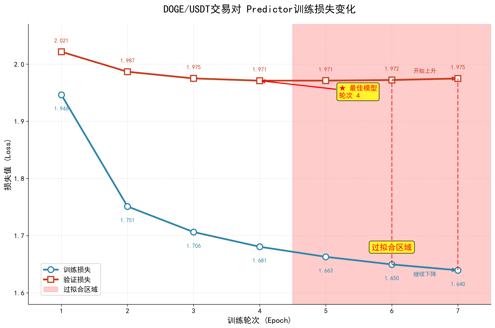
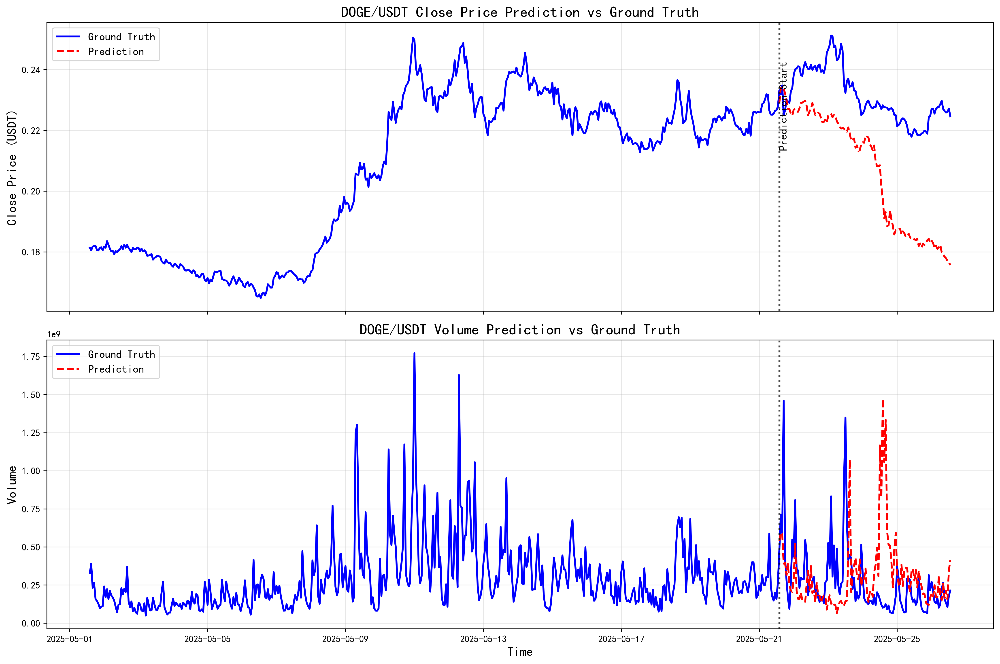

<div align="center">
  <h2><b>Kronos DOGE/USDT Fine-tuning Project</b></h2>
</div>

<div align="center">

<a href="https://huggingface.co/Ramond-e/models"> 
 
</a> 
<a href="https://github.com/shiyu-coder/Kronos"> 
 
</a> 
<a href="https://github.com/shiyu-coder/Kronos/blob/main/LICENSE"> 
 
</a>

</div>

<!-- Logo placeholder - add logo if available -->
<!-- <p align="center">

</p> -->

> 基于 **Kronos 金融基础模型**的 DOGE/USDT 加密货币微调实现  
> 包含完整的数据处理、两阶段训练和可视化分析工具

## 🎯 项目简介

本项目是基于 [Kronos](https://github.com/shiyu-coder/Kronos) 金融基础模型的 **DOGE/USDT** 加密货币微调实现。Kronos 是首个专为金融蜡烛图(K线)数据设计的开源基础模型，训练于全球45+交易所数据。

我们在此基础上开发了针对 DOGE/USDT 交易对的完整微调方案，包括：
- 🔄 **完整数据流水线** - 从原始CSV到训练就绪的数据
- 🧠 **两阶段微调** - 分别优化 Tokenizer 和 Predictor
- 📊 **实时监控** - 训练过程可视化和损失追踪
- 🛡️ **鲁棒性优化** - 异常值处理和梯度裁剪

## 🚀 主要特性

- ✅ **自定义数据处理** - 支持1小时K线数据，MAD标准化处理
- ✅ **滑动窗口训练** - 400步历史 + 120步预测窗口
- ✅ **智能模型管理** - 基于验证损失的最佳模型自动保存
- ✅ **过拟合检测** - 训练过程中的早停机制
- ✅ **训练可视化** - 损失曲线和训练进度图表
- ✅ **中断恢复** - 支持训练中断后的手动恢复

## 📁 项目结构

```
kronos/
├── finetune/                   # DOGE微调核心目录
│   ├── doge_config.py         # 配置参数
│   ├── doge_preprocess.py     # 数据预处理
│   ├── doge_dataset.py        # PyTorch数据集
│   ├── doge_train.py          # 两阶段训练脚本
│   ├── check_data_distribution.py     # 数据质量分析
│   ├── visualize_training_progress.py # 可视化工具
│   ├── prediction_eval/       # Kronos风格预测评估
│   │   └── kronos_prediction_eval.py  # 预测评估脚本
│   ├── DOGE_PROGRESS.md       # 项目进度记录
│   ├── doge_data/             # 数据目录
│   │   ├── raw/               # 原始DOGE数据
│   │   ├── processed/         # 处理后数据
│   │   └── splits/            # 训练/验证/测试集
│   ├── doge_outputs/          # 训练输出
│   │   ├── tokenizer/         # Tokenizer模型
│   │   ├── predictor/         # Predictor模型
│   │   └── logs/              # 训练日志
│   └── utils/                 # 工具函数
├── get_DOGEUSDT_data/         # 数据获取脚本
│   ├── getData.py             # Binance数据获取
│   └── dogeusdt_1h_all_klines.csv    # 历史数据
├── model/                     # Kronos模型定义
│   ├── kronos.py              # 主模型文件
│   └── module.py              # 模型组件
├── README.md                  # 项目说明
└── requirements.txt           # 依赖列表
```

## 🛠️ 快速开始

### 1. 环境安装

```bash
# 克隆仓库
git clone https://github.com/Ramond-e/Kronos-DOGEUSDT-finetune
cd kronos

# 安装依赖
pip install -r requirements.txt
```

### 2. 获取DOGE/USDT数据

```bash
# 使用Binance API获取数据
cd get_DOGEUSDT_data
python getData.py
```

### 3. 数据预处理

```bash
cd finetune
python doge_preprocess.py
```

数据处理包括：
- 时间特征生成 (小时、星期、月份等)
- 滑动窗口创建 (400历史 + 120预测)
- 鲁棒标准化 (中位数/MAD方法)
- 数据集分割 (70%/15%/15%)

### 4. 开始训练

```bash
# 启动两阶段微调
python doge_train.py
```

训练流程：
1. **阶段1**: Tokenizer微调 (5轮)
2. **阶段2**: Predictor微调 (15轮)
3. **自动保存**: 基于验证损失的最佳模型

### 5. 训练监控

```bash
# 生成训练进度可视化
python visualize_training_progress.py

# 运行Kronos风格预测评估
cd prediction_eval
python kronos_prediction_eval.py
```

## 📥 预训练模型下载

由于模型文件较大（~109MB），我们将其托管在 Hugging Face Hub 上：

### 🤗 方式1: 直接加载使用 (推荐)

```python
from model import KronosTokenizer, Kronos

# 直接从 Hugging Face 加载微调后的模型
tokenizer = KronosTokenizer.from_pretrained("Ramond-e/doge-kronos-tokenizer")
model = Kronos.from_pretrained("Ramond-e/doge-kronos-predictor")

# 使用微调后的模型进行预测
from model import KronosPredictor
predictor = KronosPredictor(model, tokenizer, device="cuda:0")
```

### 📄 方式2: 手动下载

- **DOGE Tokenizer (15MB)**: [Ramond-e/doge-kronos-tokenizer](https://huggingface.co/Ramond-e/doge-kronos-tokenizer)
- **DOGE Predictor (94MB)**: [Ramond-e/doge-kronos-predictor](https://huggingface.co/Ramond-e/doge-kronos-predictor)

下载后放置在以下位置：
```
finetune/doge_outputs/
├── tokenizer/
│   └── best_tokenizer_epoch_5.pt
└── predictor/
    └── best_predictor_epoch_4.pt
```

## 📊 训练成果

我们的DOGE/USDT微调取得了以下成果：

| 模型 | 最佳轮次 | 验证损失 | 训练时间 |
|------|----------|----------|----------|
| **Tokenizer** | Epoch 5 | 0.047491 | ~30分钟/轮 |
| **Predictor** | Epoch 4 | 1.971007 | ~5小时/轮 |

<p align="center">
    
</p>

> **注**: 图表文件位于 `finetune/doge_outputs/predictor_training_progress.png`

## 🎯 模型预测评估

### 📈 Kronos风格预测验证

基于原Kronos项目的预测方式，我们对微调后的模型进行了全面评估：

- **评估方式**: 600小时数据，前80% (480小时) 作为历史，预测后20% (120小时)
- **模型来源**: 直接从Hugging Face加载微调后的模型
- **评估脚本**: `finetune/prediction_eval/kronos_prediction_eval.py`

### 🔍 关键发现：市场时期敏感性

通过对不同月份的评估，我们发现了一个重要现象：**微调模型对不同市场时期的表现存在显著差异**

| 时间段 | 数据期间 | Close相关系数 | 方向准确率 | MAPE | 评价 |
|--------|----------|---------------|------------|------|------|
| **5月期间** | 2025-05-01 到 05-26 | **0.7683** ⭐ | 48.74% | 10.75% | 🏆 模型表现良好 |
| **4月期间** | 2025-03-20 到 04-14 | 0.4916 | 49.58% | **4.98%** ⭐ | ✅ 模型表现良好 |
| **6月期间** | 2025-06-03 到 06-28 | -0.4475 | 52.10% | 6.39% | ⚠️ 有待改进 |
| **7月期间** | 2025-07-03 到 07-28 | 0.0956 | 48.74% | 13.74% | ⚠️ 有待改进 |
| **最新期间** | 2025-08-09 到 09-03 | -0.3085 | 42.86% | 8.29% | ⚠️ 有待改进 |

**核心洞察**：
- 🎯 **最佳表现**：5月期间相关系数达到0.7683，展现优秀的趋势预测能力
- 📉 **时间敏感性**：越接近当前时间，模型表现越差，反映了市场环境的变化
- 🔄 **数值vs趋势**：4月期间数值误差最低，但5月期间趋势预测最佳
- 💡 **实用意义**：说明金融模型需要持续更新以适应市场变化

### 📊 预测结果可视化

以下是5月的预测结果图：

<p align="center">
    
</p>

> **图表说明**: 蓝色实线为真实价格和交易量，红色虚线为模型预测。黑色竖直虚线标示预测开始位置。上图显示Close价格预测，下图显示Volume交易量预测。可以看出模型在价格趋势预测方面表现较为优异（相关系数0.7683）。

### 🔧 关键优化点

- 📉 **学习率调优**: Tokenizer=5e-6, Predictor=2e-6
- 🔧 **梯度裁剪**: 阈值设为3.0防止梯度爆炸
- 📊 **数据标准化**: 使用MAD方法处理异常值
- ⏹️ **早停机制**: 在第4轮检测到过拟合并停止
- 🎯 **评估优化**: 多时间段测试发现最佳表现期

## ⚙️ 配置说明

主要参数配置 (`doge_config.py`)：

```python
# 数据参数
lookback_window = 400          # 历史窗口长度
predict_window = 120           # 预测窗口长度  
train_ratio = 0.7              # 训练集比例

# 训练参数
tokenizer_epochs = 5           # Tokenizer训练轮次
predictor_epochs = 15          # Predictor训练轮次
batch_size = 8                 # 批次大小
clip_grad_norm = 3.0           # 梯度裁剪阈值
```

## 🔗 相关资源

- 📚 **原始Kronos项目**: [shiyu-coder/Kronos](https://github.com/shiyu-coder/Kronos)
- 🤗 **预训练模型**: [NeoQuasar/Kronos-base](https://huggingface.co/NeoQuasar/Kronos-base)
- 📄 **论文**: [Kronos: A Foundation Model for the Language of Financial Markets](https://arxiv.org/abs/2508.02739)
- 🎯 **BTC/USDT交易对在线演示**: [Kronos Demo](https://shiyu-coder.github.io/Kronos-demo/)

## 📝 引用

如果本项目对您的研究有帮助，请引用原始Kronos论文：

```bibtex
@misc{shi2025kronos,
      title={Kronos: A Foundation Model for the Language of Financial Markets}, 
      author={Yu Shi and Zongliang Fu and Shuo Chen and Bohan Zhao and Wei Xu and Changshui Zhang and Jian Li},
      year={2025},
      eprint={2508.02739},
      archivePrefix={arXiv},
      primaryClass={q-fin.ST},
      url={https://arxiv.org/abs/2508.02739}, 
}
```

## 📜 许可证

本项目遵循开源许可协议 (基于原始 Kronos 项目许可证)。

---

<div align="center">
  <sub>Built with ❤️ based on Kronos Foundation Model</sub>
</div>